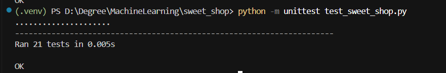

# Sweet Shop Management System

  

This project is a complete backend system for managing a sweet shop inventory, built using Test-Driven Development (TDD) principles. It features a user-friendly Streamlit frontend for interactive management. Developed as a take-home assignment to demonstrate clean code, SOLID principles, and robust testing.
## App Demo
![App Demo]  https://drive.google.com/file/d/1Dp2LM4Q_WnJVMLsCUzLqTVKsagKjbWr9/view?usp=sharing

## Features
- **Sweet Management**: Add, delete, view, search (by name, category, price range), purchase, and restock sweets.
- **Attributes**: Each sweet has a unique ID, name, category, price, and quantity.
- **Persistence**: Data saved in JSON for session persistence.
- **Validations**: Unique names, positive values, stock checks.
- **UI**: Elegant Streamlit interface with tabs, forms, tips, and real-time updates.
- **Testing**: Comprehensive unit tests with edge cases.

## Technologies Used
- Python 3.10+
- Streamlit for frontend
- Pandas for data display
- Unittest for TDD

## Setup
1. Clone the repository: `git clone https://github.com/Aafimalek/sweet_shop`
2. Create and activate a virtual environment: `python -m venv venv` then `source venv/bin/activate` (Unix) or `venv\Scripts\activate` (Windows).
3. Install dependencies: `pip install -r requirements.txt`

## Running the Application
- Launch the app: `streamlit run app.py`
- Open in browser: http://localhost:8501
- Navigate tabs to manage inventory.

## Running Tests
- Execute: `python -m unittest test_sweet_shop.py`
- View results in console or see screenshot below.

### Test Results

## TDD Approach
All features were developed test-first: Wrote failing tests for each method/edge case, then implemented minimal code to pass. Covers happy paths, errors, and boundaries like zero stock, invalid IDs.

## File Structure
- `sweet_shop.py`: Core logic (Sweet class, management system).
- `app.py`: Streamlit UI.
- `test_sweet_shop.py`: Unit tests.
- `requirements.txt`: Dependencies.
- `sweets.json`: Data storage.
- `.gitignore`: Excludes temp files.
- `README.md`: This file.

## License
MIT License - free to use and modify.

For questions, contact aafimalek2023@gmail.com. This project showcases my skills in Python, TDD, and rapid prototyping for job applications.

